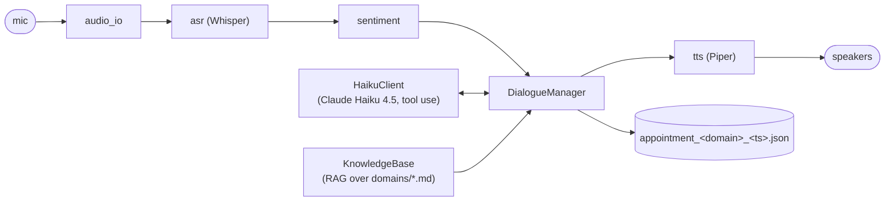

# VoiceAppointmentChatBot

A bilingual (English / Hungarian) voice chatbot that books appointments
with a veterinary practice. The user speaks into the microphone, the bot transcribes the utterance, detects the language and sentiment, and responds with synthesised speech. The dialogue asks for the most important information to be confirmed. User identification (name, email, phone number or other method), time, treatment or service chosen, other extra information requested (e.g. emotional state). Final appointment details are written to a JSON file.

## Setup and run

Requires Python 3.12, [`uv`](https://docs.astral.sh/uv/), Node 18+ and `ffmpeg` on PATH (the server shells out to ffmpeg once per utterance to decode the browser's WebM/Opus audio into 16 kHz PCM for Whisper).

```bash
# CPU-only install
uv sync
# NVIDIA GPU users (~1.2 GB extra wheels)
uv sync --extra cuda
# then edit huggingface.token
cp config.yaml.example config.yaml
# build frontend
cd frontend
pnpm install
pnpm run build
# start the app
cd ..
# serves SPA + WebSocket on http://127.0.0.1:8000
uv run vetbot-web
```

GPU acceleration on NVIDIA cards is opt-in via the `cuda` extra, which
installs the cuBLAS, cuDNN, and NVRTC runtime wheels needed by
CTranslate2. No separate CUDA Toolkit install is required; the wheels
ship the DLLs and `voiceappointmentchatbot.gpu_runtime` registers them
on the Windows DLL search path (and prepends them to `PATH`) before
CTranslate2 loads.

## Development
```bash
# unit tests
uv run --extra dev pytest
# lint
uv run --extra dev ruff check .
# type-check
uv run --extra dev mypy src
```

## Architecture

The pipeline is a classic cascade so each stage is observable, testable,
and swappable. Audio flows left to right; the JSON output is produced by
the dialogue manager once all required slots are filled (week 2+).



## Decisions

The table below records every architectural decision made during week-one
brainstorming and why it was chosen. Each row is durable: when a decision
changes in a later week, update it here together with the reason.

| Area | Decision | Rationale |
| --- | --- | --- |
| Pipeline shape | Classic cascade (ASR -> NLU -> TTS) | Each stage is debuggable and screenshot-friendly for the lab report; matches the assignment hints. |
| Languages | English and Hungarian from day one | Course requirement and likely competition criterion; covered by a single ASR model. |
| ASR engine | `faster-whisper` (CTranslate2) | Same accuracy as `openai-whisper` with ~4x throughput and lower VRAM, on both GPU and CPU. |
| Whisper model | `large-v3` on CUDA, `small` on CPU | `large-v3` gives the best Hungarian accuracy and fits in 16 GB VRAM; `small` keeps the CPU fallback usable. |
| Whisper compute type | `float16` on CUDA, `int8` on CPU | Default fast path on each device. |
| Language detection | Whisper auto-detect per utterance | One model handles EN and HU; downstream code keys off `transcript.language`. |
| Extra signal | Text-based sentiment (positive / neutral / negative) | Simpler and more reliable than audio emotion across EN+HU; easy to write up. |
| Sentiment model | `cardiffnlp/twitter-xlm-roberta-base-sentiment` | Multilingual XLM-RoBERTa, trained on three-class sentiment, supports HU. |
| TTS engine | Piper, voices `en_US-lessac-medium` and `hu_HU-anna-medium` | Local, fast, decent native Hungarian voice; no API dependency. |
| Dialogue (week 1) | Echo policy with sentiment acknowledgement | Assignment only requires a simple response in week one; slot-filling state machine planned for week 2. |
| Runtime | CLI with hold-to-record (Enter to start, Enter to stop) | Robust and unambiguous endpointing for a noisy microphone in week one; web/custom frontend planned later. |
| Domain | Veterinary appointments | Chosen by the author. Slot vocabulary will reflect pet name, species, complaint, etc. |
| Device handling | Auto-detect CUDA via ctranslate2, fall back to CPU | faster-whisper drives the GPU through CTranslate2, so we do not need a CUDA-enabled PyTorch wheel in week 1. Avoids the Blackwell / cu128 wheel issue on the RTX 5070 Ti. |
| CUDA runtime | NVIDIA cuBLAS + cuDNN + NVRTC pip wheels via the `cuda` extra | Avoids forcing users to install the ~3 GB system CUDA Toolkit; wheels are vendored into `site-packages/nvidia/<lib>/bin/` and exposed to CTranslate2 by `gpu_runtime.py` patching `PATH` and the DLL search path on import. |
| Local config | `config.yaml` (gitignored) overlaying defaults, `config.yaml.example` committed | Keeps the Hugging Face token and other personal overrides out of version control while letting users tune model choices without editing code. |
| Python version | 3.12 | NeMo / PyTorch / faster-whisper wheels are stable on 3.12; 3.14 is too new in early 2026. |
| Project layout | `src/` layout, package name `voiceappointmentchatbot` | Standard modern Python packaging; prevents accidental imports of the working tree. |
| Build backend | Hatchling via `pyproject.toml` | Default for modern Python projects, already what `uv` ships with. |
| Output schema | Single JSON object per appointment under `output/` | Required deliverable; one file per booking keeps inspection trivial. (Slot-filling lands in week 2.) |
| TTS audio path | Concatenate `AudioChunk.audio_float_array` from Piper's streaming `synthesize`, append 300 ms of trailing silence | Piper 1.4+ no longer writes WAVs; assembling float samples directly avoids a WAV roundtrip. The trailing silence prevents Windows audio drivers from clipping the last word when `sd.wait()` returns before the buffer fully drains. |
| Tokenizer dependency | Pin `sentencepiece` explicitly | XLM-RoBERTa's tokenizer is a SentencePiece BPE model; without it `transformers` silently falls back to TikToken and crashes. |
| LLM (week 2) | Claude Haiku 4.5 | Fast, cheap, strong at tool use, multilingual out of the box; the booking flow needs reliable structured output more than long-context reasoning. |
| Tool use over freeform JSON | Slot updates flow through declared tools | Asking the model to "respond as JSON" is unreliable; explicit tools with JSON-Schema arguments mean Haiku cannot invent fields and the local code can validate every call. |
| Prompt caching | `cache_control: ephemeral` on the system block | The bilingual system prompt is large and identical across turns; cache reads turn it into pennies after the first turn of a session. |
| Bilingual single system prompt | One block with EN and HU sections | Simpler than swapping system prompts on every detected language change, and lets the model follow mid-conversation EN/HU switches without losing booking state. |
| RAG implementation | Inlined sentence-transformers + numpy cosine | A real vector database is overkill at the few-dozen-chunk scale of these knowledge bases; the inlined version is one file with no extra services. |
| Markdown chunking | Split tables row-by-row | The first version split on headings and paragraphs only, and the real-embedder integration test failed: a "how much is dental cleaning?" query retrieved the surrounding paragraph instead of the price-table row. Splitting tables row-by-row fixes that and is the most interesting decision in week 2. |
| Domain registry | YAML + sibling Markdown pair under `domains/` | Adding a new business domain is two files (slots + KB) with no Python changes; keeps the project demo-friendly and extensible without new abstractions. |
| Output JSON shape | Promote `customer.name` and `customer.phone`, leave the rest flat under `slots` | Every domain carries those two fields and graders skim the file by eye; keeping the rest flat avoids per-domain nesting churn. |
| Phone digit-readback | Render stored phone as EN/HU digit words and require `confirm_phone` | Whisper mishears digits often (especially in HU: "kettő" / "hét"); reading back digit-by-digit before persisting is cheap insurance against a saved booking we can't actually call back. |
| Sentiment aggregation | Majority label across all scored user turns, ties broken by mean confidence | Single-utterance sentiment is noisy — one short "yes" turn often flips the label; averaging across the whole booking is more representative of the customer's actual mood. |

## Project layout

```
.
├── src/voiceappointmentchatbot/
│   ├── __init__.py
│   ├── config.py             # AppConfig, YAML loader, device detection, model selection
│   ├── gpu_runtime.py        # Registers vendored NVIDIA DLLs on the Windows search path
│   ├── audio_io.py           # HoldToRecord microphone capture
│   ├── asr.py                # WhisperTranscriber + Transcript dataclass
│   ├── sentiment.py          # TextSentimentAnalyzer + SentimentResult
│   ├── tts.py                # PiperSpeaker (lazy multi-voice, auto-download, silence pad)
│   ├── domains.py            # Domain + SlotSpec loader for domains/*.yaml
│   ├── booking.py            # BookingState, slot validation, phone digit readback
│   ├── booking_writer.py     # AppointmentRecord, SentimentSummary, JSON writer
│   ├── knowledge.py          # KnowledgeBase: markdown chunking + sentence-transformer RAG
│   ├── llm.py                # HaikuClient, system prompt + tool declarations
│   ├── dialogue.py           # Slot-filling DialogueManager + tool dispatch loop
│   └── main.py               # CLI entry point: `vetbot`
├── domains/
│   ├── vet.yaml / vet.md
│   └── hairdresser.yaml / hairdresser.md
├── tests/
│   ├── test_dialogue.py
│   ├── test_domains.py
│   ├── test_booking.py
│   ├── test_booking_writer.py
│   ├── test_knowledge.py
│   ├── test_llm.py
│   └── test_main.py
├── models/piper/        # Piper voice files (gitignored, auto-populated on first run)
├── output/              # Appointment JSON files (gitignored)
├── docs/                # Lab report assets and screenshots
├── config.yaml.example  # template (committed)
├── config.yaml          # local overrides + HF token (gitignored)
├── pyproject.toml
└── README.md
```
